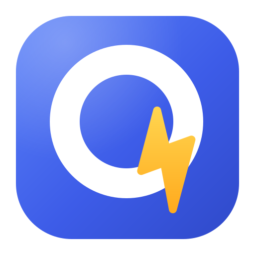
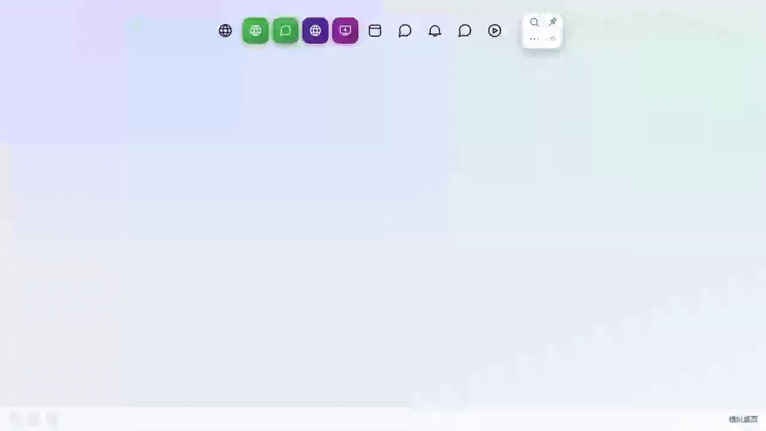
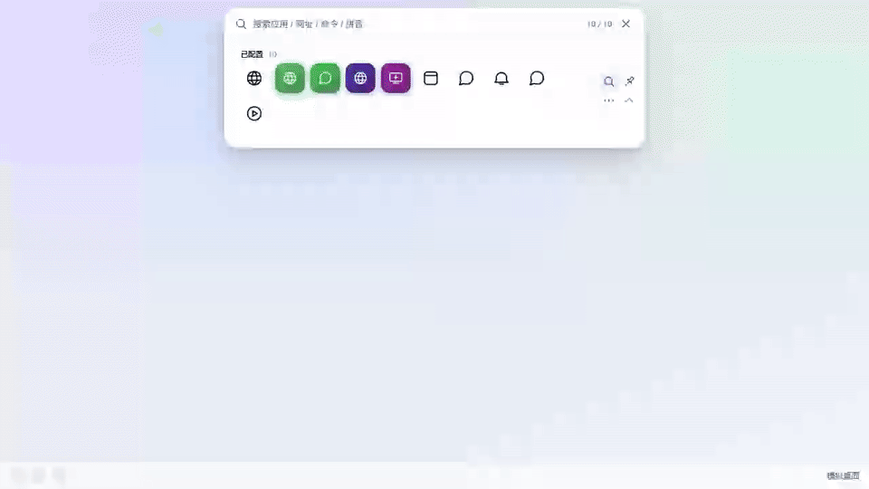
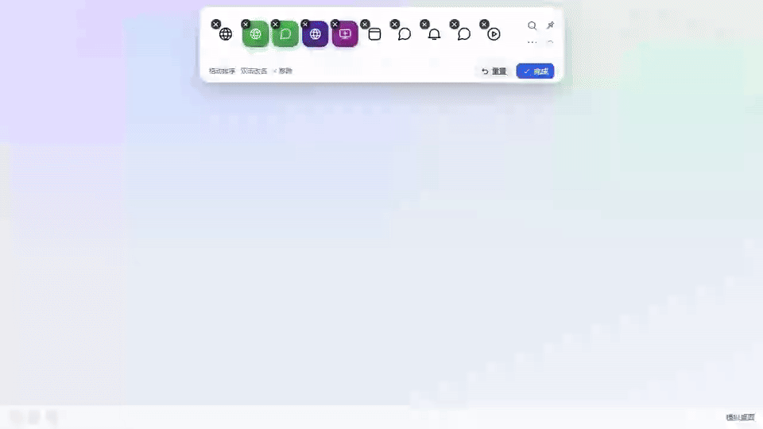
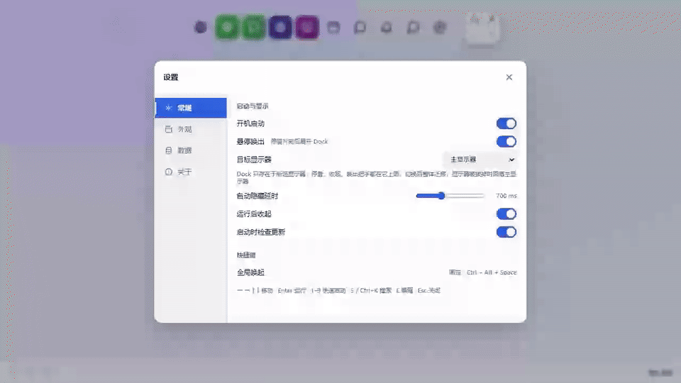

# QuickApp

<p align="center">
  
</p>

[](https://github.com/dotnet9/QuickApp/actions/workflows/ci.yml)
[](LICENSE)

QuickApp 是一个跨平台的系统快捷启动器，用常驻 Dock 统一打开应用、文件、目录、网址和常用命令。支持四边停靠、搜索和 Windows 全局快捷键，平时只占一排图标（Windows 功能最全，Linux / macOS 提供核心功能）。

## 界面预览

动图录制自 [`design`](design) 目录的 HTML 界面原型，Avalonia 实现与原型保持一致。

| 四边停靠 · 悬停放大 · 点击启动 | 拼音搜索 · 系统应用 · 加入 Dock |
| :---: | :---: |
|  |  |
|  |  |
| **编辑模式 · 拖动排序 · 就地改名** | **设置窗口 · 外观实时预览** |

搜索支持中文名、拼音全拼 / 首字母、路径与命令参数；开始菜单里未配置的应用可直接启动，或点 `＋` 加入 Dock。此外还有：多显示器定位、全局热键、触边唤出、移除可撤销、配置导入导出、便携模式、开机启动、托盘菜单、按平台选包的更新检查，以及设置里的「推荐」——一键安装作者自研软件（安装包实时取自各仓库最新发布），装完自动加入 Dock。

## 快速开始

在「更多」里添加文件、目录、网址或命令；右键已有条目选择「编辑…」，可修改名称、目标路径、启动参数、工作目录和快捷键。搜索结果区域最高 300，超过后纵向滚动。

打开目录可以直接添加目录，无需写命令。Windows 下在条目编辑中设置 `Ctrl+Alt+D` 等组合键，QuickApp 运行时即可直接打开，Dock 收起也有效。命令可选择 CMD 或 PowerShell；新命令默认在终端运行并保留输出，例如把 `git status` 配合仓库工作目录保存为常用操作。

从 [Releases](https://github.com/dotnet9/QuickApp/releases) 下载安装包（Windows 安装包 / Linux `.deb` / macOS `.pkg`、`.dmg`），或源码直接运行：

```powershell
dotnet run --project src/QuickApp/QuickApp.csproj
```

| 按键 | 作用 |
| --- | --- |
| `S` / `Ctrl+K` | 打开搜索 |
| `Enter` | 启动第一个结果 |
| `1` – `9` | 启动对应图标 |
| `E` / `Esc` | 进入 / 退出编辑模式 |

拖动图标区空白处可移动 Dock，松手自动吸附到最近的边缘。

## 开发

需要 .NET 10 SDK（`10.0.401`）：

```powershell
dotnet build QuickApp.slnx   # 构建
dotnet test QuickApp.slnx    # 测试
```

界面按「原型先行」维护：先改唯一入口 [design/index.html](design/index.html) 的交互原型，再同步 Avalonia 实现。所有界面通过 Dock、菜单、右键或设置打开，共用数据和状态；`design` 不再新增其他 HTML 页面。环境要求、发布打包、项目结构与贡献规范见 [docs/DEVELOPMENT.md](docs/DEVELOPMENT.md)。

## 许可证

[MIT](LICENSE)

## 发布

标准发布流程与发布说明规范见 [docs/RELEASE.md](docs/RELEASE.md)。
